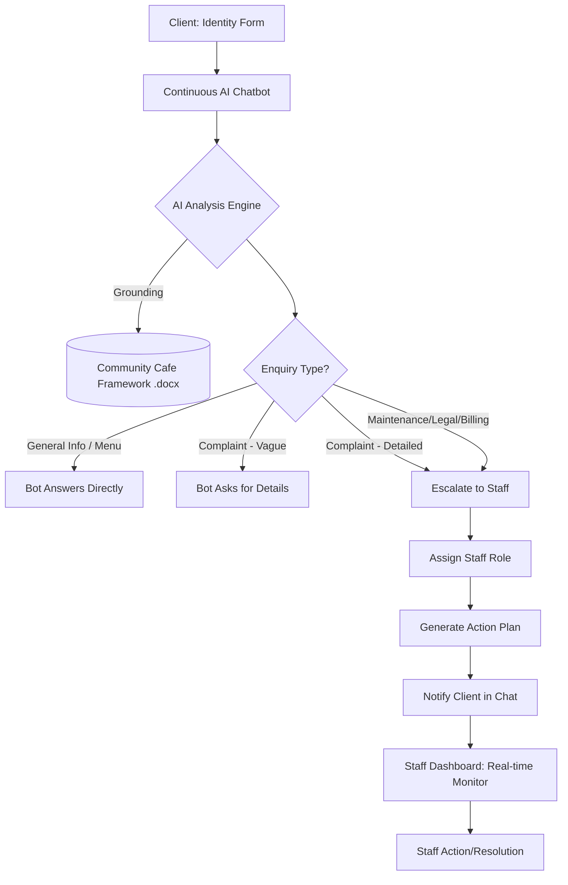

# AI Enquiry Console — Strata Management Consultants

An AI-powered, conversational support system designed to streamline strata enquiries and community cafe management. The system uses **Google Gemini 2.0 Flash** (with Groq fallback) to intelligently triage client requests, answer policy questions, and escalate complex issues to the right staff member.

## 🚀 System Architecture & Flow



## 🧠 Core Logics

### 1. Conversational Grounding
The AI is strictly grounded in the **Community Cafe Framework & Menu Concept** document. It knows the location (Butuan City), operating hours (7am-9pm), and entire menu pricing. It will not "hallucinate" facts outside this framework.

### 2. Multi-Turn Clarification
The system follows a "Clarify-Before-Escalate" logic for complaints. 
- **Stage 1 (Vague)**: If a user says "I want to complain," the AI identifies the category but stays in the bot phase to ask for "What, When, and Who."
- **Stage 2 (Actionable)**: Only after details are provided does the AI trigger the internal triage recommendation and notify the user of the specific staff handoff.

### 3. Smart Staff Routing
Enquiries are automatically routed based on category:
- **Client Relationship Manager**: New client onboarding.
- **Maintenance Coordinator**: Physical property issues.
- **Billing & Accounts Officer**: Levies and payments.
- **Customer Support Lead**: All formal complaints and escalations.
- **Front Desk**: General informational queries.

---

## 🛠️ How to Use

### For Clients (The Chatbot)
1.  Navigate to the home page.
2.  Fill in your **Name, Email, and Property Address**.
3.  Click **Start Conversation**.
4.  Type your questions naturally (e.g., *"What's the student discount?"* or *"I need to report a leak"*).

### For Staff (The Dashboard)
1.  Access the **Enquiry Dashboard**.
2.  Incoming enquiries appear in real-time with:
    *   **AI Confidence Score** (How sure the AI is about the classification).
    *   **Priority Badge** (Urgent/High/Medium/Low).
    *   **Action Plan** (AI-suggested next steps).
3.  Click **Re-analyze** if you wish to override the classification or get a fresh AI perspective.

---

## ⚙️ Setup & Installation

Follow these steps to run the system locally after cloning:

### 1. Install Dependencies
```bash
npm install
```

### 2. Configure Environment Variables
Create a `.env` file in the root directory and add the following keys:
```env
# Supabase Configuration
SUPABASE_URL=your_project_url
SUPABASE_ANON_KEY=your_anon_key
SUPABASE_SERVICE_ROLE_KEY=your_service_role_key

# AI Configuration (At least one required)
GEMINI_API_KEY=your_google_gemini_key
GROQ_API_KEY=your_groq_key
```

### 3. Database Setup
The system uses Supabase. Ensure you have an `enquiries` table with the following schema (or run the migrations in `/supabase/migrations`):
- `client_name` (text)
- `client_email` (text)
- `message` (text)
- `category` (text)
- `priority` (text)
- `assigned_staff` (text)
- `status` (text)

### 4. Run the Application
```bash
npm run dev
```
The app will be available at `http://localhost:8080`.

---

## 💻 Tech Stack
- **Frontend**: React, TanStack Start, Tailwind CSS (v4).
- **Backend**: TanStack Server Functions, Supabase.
- **AI**: Google Gemini 2.0 Flash SDK, Groq (Llama 4 Fallback).
- **Knowledge Base**: `python-docx` for framework extraction.

---

## 📁 Repository Structure
- `src/components/new-client-chatbot.tsx`: The continuous chat interface.
- `src/lib/enquiries.functions.ts`: AI prompt engineering, schema validation, and server-side triage.
- `community_guidelines_ai.py`: Standalone CLI tool for knowledge base testing.
- `community_cafe_full_framework.docx`: The primary source of truth for cafe policies.

